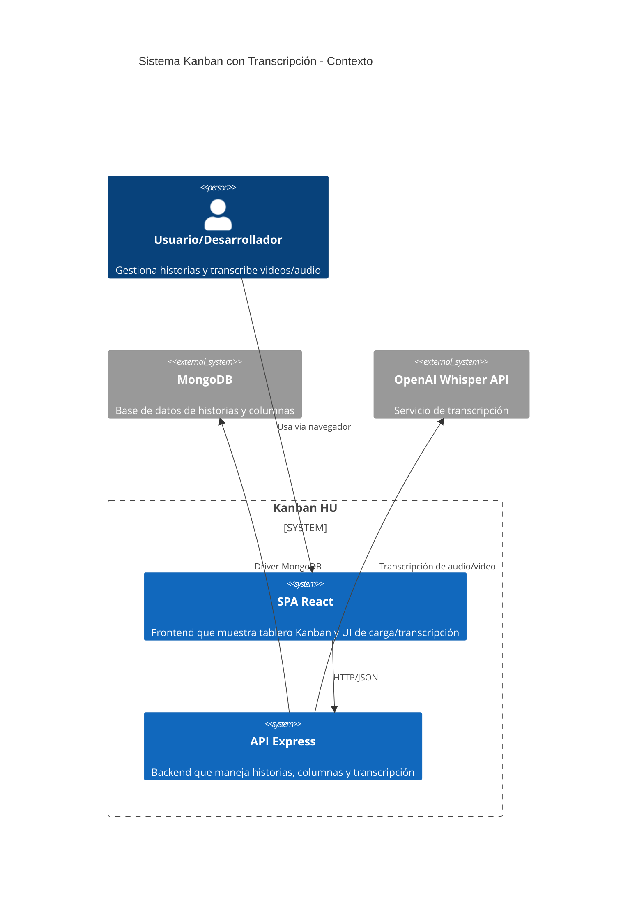
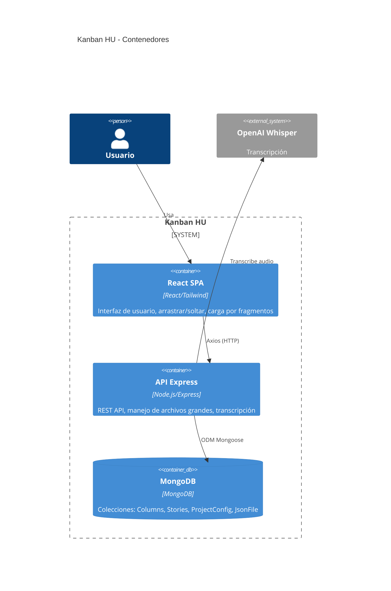
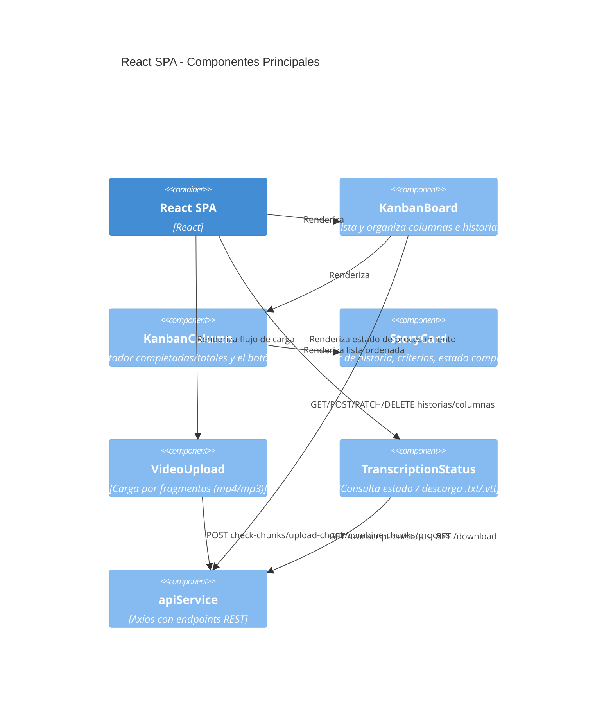
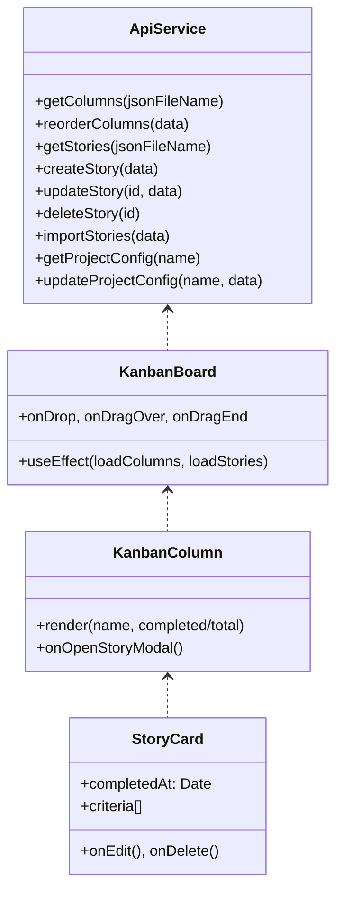
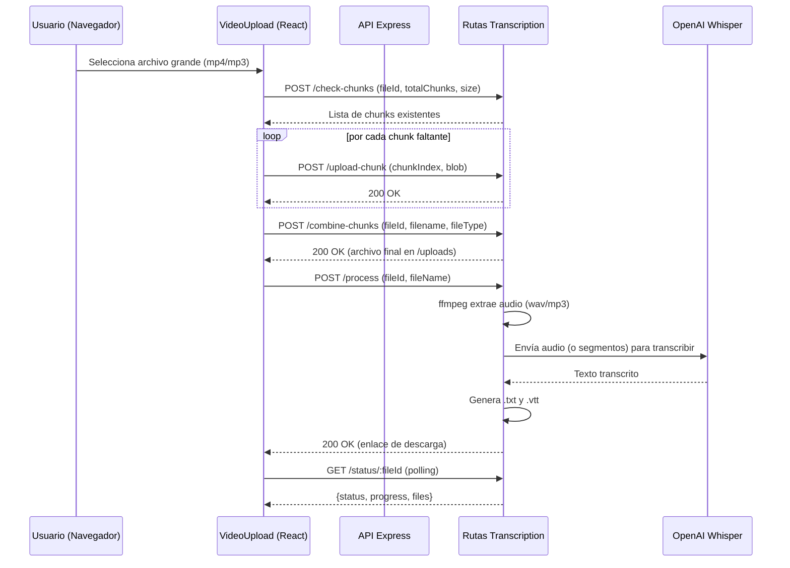

# Documentación del Cliente (Frontend)

Este documento describe la arquitectura del cliente de la aplicación Kanban, los principales componentes, flujos, y los diagramas C4 (contexto, contenedores, componentes, código), además de un diagrama de secuencia para la carga y transcripción de videos/audio.

## Tecnologías

- React (SPA)
- Tailwind CSS para estilos
- Axios para consumo de API (`client/src/services/api.js`)
- Soporte de carga por fragmentos (chunked upload) desde componentes (`VideoUpload`, `TranscriptionStatus`, `FileUpload`)

## Estructura relevante del cliente

- `client/src/App.js`: Entradas de vistas y orquestación de tabs
- `client/src/components/KanbanBoard.js`: Tablero principal
- `client/src/components/KanbanColumn.js`: Columna con contador de historias completadas/totales
- `client/src/components/StoryCard.js`: Tarjeta de historia con criterios y estado `completedAt`
- `client/src/components/VideoUpload.js`: Carga de archivos mp4/mp3 en fragmentos
- `client/src/components/TranscriptionStatus.js`: Consulta de estado de transcripción y descarga de resultados
- `client/src/services/api.js`: Cliente Axios y endpoints

---

## C4 - Nivel 1: Diagrama de Contexto

---

## C4 - Nivel 2: Diagrama de Contenedores

---

## C4 - Nivel 3: Diagrama de Componentes (Frontend)

---

## C4 - Nivel 4: Diagrama de Código (Vista Lógica)

Nota: Simplificado para mostrar relaciones lógicas.

---

## Diagrama de Secuencia: Carga y Transcripción

---

## Estrategia de Transcripción de Archivos Grandes (Vista Cliente)

- **División en fragmentos (chunking)** en el navegador (p. ej. 50–100 MB por chunk) para cargas robustas.
- **Reanudación**: verificar con `/api/transcription/check-chunks` los fragmentos ya recibidos.
- **Control de progreso**: escuchar el progreso de `axios` y mostrar en UI.
- **Confirmación**: tras subir todos los chunks, llamar a `/combine-chunks`.
- **Procesamiento**: iniciar `/process` y usar `TranscriptionStatus` con polling a `/status/:fileId`.
- **Descarga**: mostrar links a `/download/<fileId>.txt` y `.vtt` cuando `status=completed`.

---

## Configuración y Variables

- `REACT_APP_API_URL`: base de la API (por defecto `http://localhost:5000/api`).

---

## Temas de Usabilidad (UX)

### Sistema de Diseño Apple-Inspired

Se implementó un rediseño completo del frontend siguiendo principios de diseño de Jony Ive, Dieter Rams y Apple Human Interface Guidelines (HIG), priorizando minimalismo, honestidad funcional y jerarquía visual clara.

#### Paleta de Colores

| Token | Uso | Valor principal |
|-------|-----|-----------------|
| `primary-500` | Acciones principales, links activos | `#0a84ff` (Apple Blue) |
| `success-500` | Estados completados, progreso | `#30d158` (Apple Green) |
| `danger-500` | Acciones destructivas, errores | `#ff453a` (Apple Red) |
| `warning-500` | Alertas | `#ff9f0a` (Apple Orange) |
| `neutral-100` | Fondos principales | `#f5f5f7` (Apple Light Gray) |
| `neutral-900` | Texto principal | `#2c2c2e` |

#### Tipografía

- Font stack: `-apple-system`, `BlinkMacSystemFont`, `SF Pro Display`, `Helvetica Neue`
- Letter-spacing negativo en títulos (`-0.022em`) para legibilidad a mayor tamaño
- Escala tipográfica con line-height optimizado por nivel

#### Componentes Rediseñados

| Componente | Cambios principales |
|------------|---------------------|
| `Header` | Minimalista, alineado a la izquierda, badge de estado "Sincronizado" |
| `TabSystem` | Estilo segmented control (iOS), fondo `neutral-100`, tab activo con sombra y fondo blanco |
| `AddColumnForm` | Card elevada, botones con iconos (`FiPlus`, `FiZap`), badge de conteo de usuarios |
| `KanbanColumn` | Fondo semi-transparente, barra de progreso, empty state con icono |
| `StoryCard` | Jerarquía visual clara, acciones en hover, micro-barras de progreso |
| `KanbanTab` | Icono de sección, subtítulo con nombre del proyecto |

#### Jerarquía Visual en StoryCard

La tarjeta de historia prioriza la información así:

1. **Prioridad 1 - Título de la tarea**: Texto `text-[15px] font-semibold`, el elemento más prominente
2. **Prioridad 2 - ID del proyecto (nomenclatura)**: Badge azul (`bg-primary-50 text-primary-600`) con icono de etiqueta, posicionado arriba del título
3. **Prioridad 3 - Usuario asignado**: Badge neutral discreto con icono de persona
4. **Prioridad 4 - Estado/Fecha de completado**: Texto pequeño verde si aplica

#### Elevación y Sombras

Se definió un sistema de sombras progresivas:

- `shadow-apple-sm`: Elementos en reposo (botones)
- `shadow-apple`: Cards y contenedores
- `shadow-apple-md`: Hover en cards
- `shadow-apple-lg`: Elementos elevados (drag)
- `shadow-apple-xl`: Modales

#### Microinteracciones

- Transiciones con curvas Apple (`cubic-bezier(0.25, 0.1, 0.25, 1)`)
- Acciones de tarjeta (editar/eliminar) se muestran solo en hover
- Animaciones de entrada (`fade-in`, `slide-up`, `scale-in`)
- Drag and drop con rotación y escala (`rotate-2 scale-105`)
- Barras de progreso animadas con `transition-all duration-500`

#### Accesibilidad

- Focus visible con anillo azul semi-transparente (`ring-4 ring-primary-500/30`)
- Scrollbar estilizado discreto
- Contraste de texto cumple ratio AAA en elementos principales
- Tooltips en botones de acción

#### Botón "Agregar automáticamente"

Se agregó funcionalidad para crear columnas automáticamente basándose en el atributo `usuario` del JSON importado:

- Crea una columna por cada usuario único encontrado en las historias
- Asigna las historias a sus columnas correspondientes
- Muestra badge con la cantidad de usuarios detectados
- Se deshabilita si no hay usuarios en las historias

#### Archivos Modificados

- `tailwind.config.js`: Tokens de diseño (colores, tipografía, sombras, animaciones, border-radius)
- `src/index.css`: Estilos globales, clases de componente (`.btn-*`, `.card`, `.input`, `.badge-*`)
- `src/components/Header.js`
- `src/components/TabSystem.js`
- `src/components/AddColumnForm.js`
- `src/components/KanbanColumn.js`
- `src/components/KanbanTab.js`
- `src/components/StoryCard.js`
- `src/App.js` (contenedor principal y error banner)

---

## Notas

- El estado de completado de historias se basa en `story.completedAt`.
- Arrastrar/soltar: gestionado por componentes Kanban y servicios en `api.js`.
