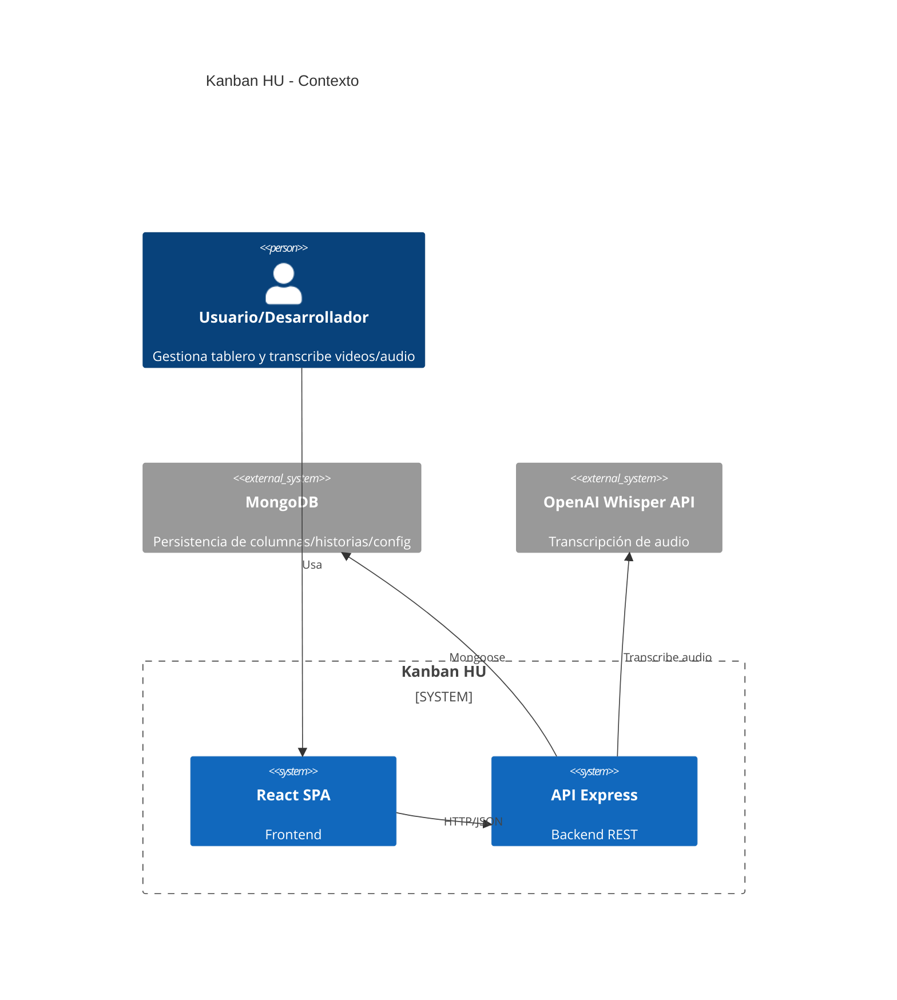
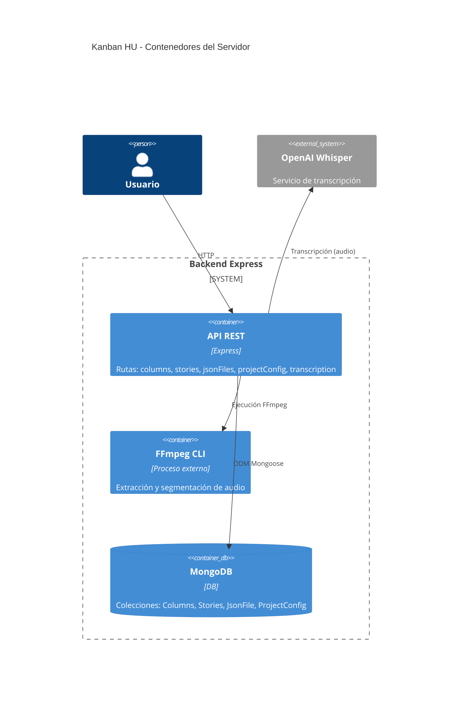
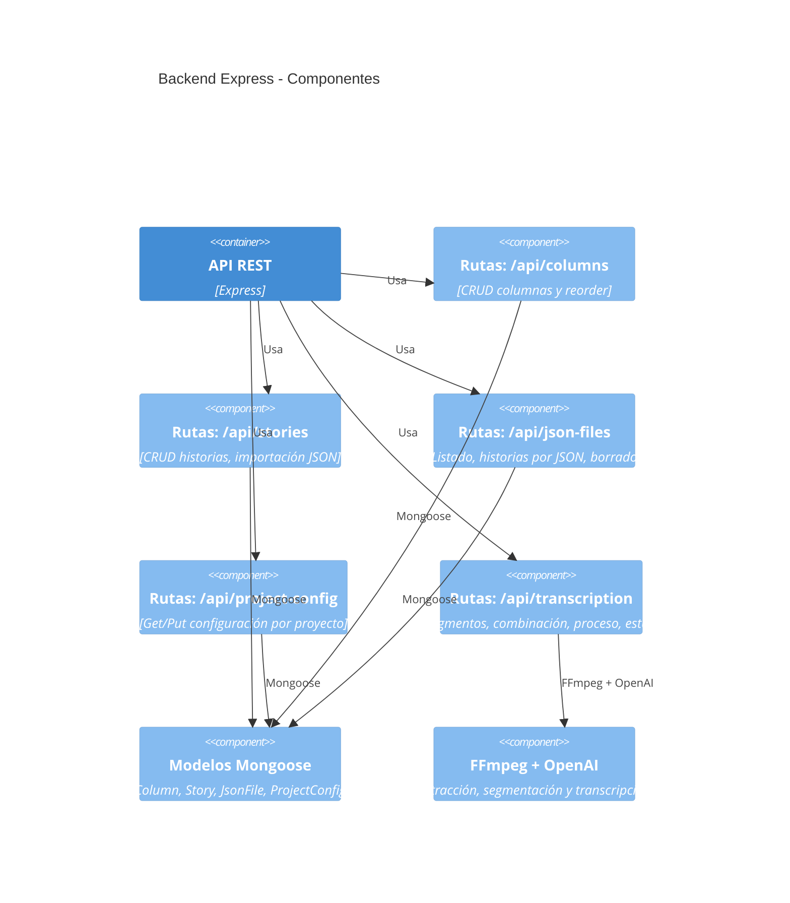
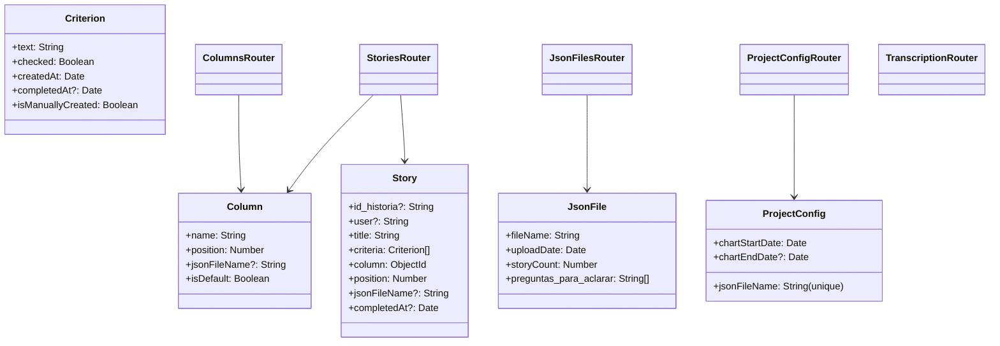
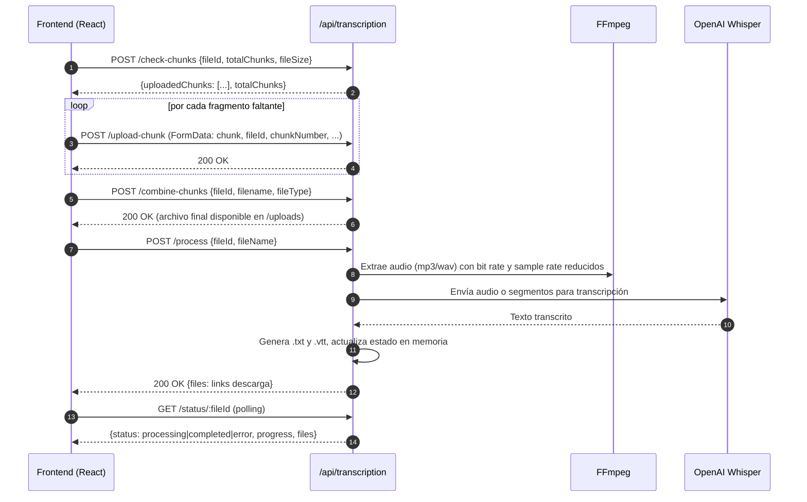

# Documentación del Servidor (Backend)

Este documento describe la arquitectura del servidor de la aplicación Kanban HU, los endpoints disponibles, los diagramas C4 (contexto, contenedores, componentes, código) y el flujo de carga/transcripción de archivos grandes (MP4/MP3) con su estrategia de escalado.

## Tecnologías

- Node.js + Express.js
- Mongoose (ODM) para MongoDB
- Multer para manejo de subida de archivos (fragmentos)
- FFmpeg (vía `fluent-ffmpeg` y `@ffmpeg-installer/ffmpeg`) para extracción/segmentación de audio
- OpenAI Whisper API para transcripción

Rutas principales:
- `server/server.js` expone los routers bajo `/api/*`.
- `server/routes/columns.js`
- `server/routes/stories.js`
- `server/routes/jsonFiles.js`
- `server/routes/projectConfig.js`
- `server/routes/transcription.js`

Modelos:
- `server/models/Column.js`
- `server/models/Story.js`
- `server/models/ProjectConfig.js`
- `server/models/JsonFile.js`

---

## C4 - Nivel 1: Diagrama de Contexto

---

## C4 - Nivel 2: Diagrama de Contenedores (Servidor)

---

## C4 - Nivel 3: Diagrama de Componentes (Servidor)

---

## C4 - Nivel 4: Diagrama de Código (Modelo/Router)

Representación lógica simplificada de relaciones entre modelos y rutas.

---

## Endpoints (Resumen)

- `/api/columns`
  - GET `/` listar columnas (con `jsonFileName` opcional)
  - POST `/` crear columna
  - GET `/:id` obtener columna y sus historias
  - PATCH `/:id` actualizar columna
  - PATCH `/reorder` reordenar columnas
  - DELETE `/:id` eliminar columna (y sus historias)

- `/api/stories`
  - GET `/` listar historias (con `jsonFileName` opcional)
  - POST `/` crear historia
  - GET `/:id` obtener historia
  - PATCH `/:id` actualizar historia (column, position, criteria, completedAt, etc.)
  - DELETE `/:id` eliminar historia
  - POST `/import` importar historias desde JSON

- `/api/json-files`
  - GET `/` listar JSONs cargados
  - GET `/:fileName` obtener metadatos del JSON
  - GET `/:fileName/stories` obtener historias y columnas asociadas
  - DELETE `/:fileName` eliminar JSON, historias y columnas asociadas no-default

- `/api/project-config`
  - GET `/:jsonFileName` obtener configuración del proyecto
  - PUT `/:jsonFileName` actualizar configuración del proyecto

- `/api/transcription`
  - POST `/check-chunks` verificar fragmentos existentes
  - POST `/upload-chunk` subir un fragmento de archivo
  - POST `/combine-chunks` combinar fragmentos en archivo final
  - POST `/cancel-upload` cancelar y limpiar fragmentos temporales
  - POST `/process` procesar archivo (extraer audio, transcribir, generar `.txt/.vtt`)
  - GET `/status/:fileId` consultar estado de transcripción
  - GET `/download/:filename` descargar archivos generados (.txt/.vtt)
  - POST `/upload` [obsoleto] responde 410 e indica usar el sistema por fragmentos

> Nota: Los endpoints de chunked upload están implementados en `server/routes/transcription.js` junto con lógica de limpieza y límites. En `server/server.js` se configuran CORS, límites de tamaño y directorios (`/uploads` y `/uploads/temp`).

---

## Diagrama de Secuencia: Upload + Transcripción (Servidor)

---

## Estrategia para Transcripción de MP4/MP3 Grandes

Basada en el código actual de `server/routes/transcription.js` y `UPLOAD_README.md`.

- **Chunked Upload (Cliente y Servidor)**
  - Dividir el archivo en chunks de 50–100 MB.
  - Cliente llama a `/check-chunks` para reanudar cargas.
  - Sube cada fragmento a `/upload-chunk` (Multer con `diskStorage` en `uploads/temp`).
  - Al completar, `/combine-chunks` crea el archivo final en `uploads/`.
  - Se proveen tareas de limpieza periódicas de temporales.

- **Extracción y Compresión de Audio (FFmpeg)**
  - Convertir a mono, 16kHz, bitrate bajo (p. ej., 48kbps) para reducir tamaño.
  - Generar `.wav` o `.mp3` intermedio reducido.
  - Tiempo de espera y logs de progreso para operaciones largas.

- **Segmentación para superar límites**
  - Whisper típicamente acepta hasta ~25MB por solicitud.
  - Si el audio excede, dividir en segmentos (ej. 5 minutos) con FFmpeg (`-f segment -segment_time 300`).
  - Transcribir cada segmento secuencialmente (o con concurrencia limitada) y concatenar los textos.

- **Resiliencia y reintentos**
  - `fetchWithRetry(fn, maxRetries=3)` para llamadas a OpenAI con backoff exponencial ante 429 o 5xx.
  - Manejo de timeouts (p. ej., 30 minutos) y abort controller.

- **Estado y Seguimiento**
  - `transcriptionStatus` en memoria para progreso, mensajes y enlaces a resultados.
  - Endpoint `/status/:fileId` para polling desde el cliente.

- **Salida VTT + TXT**
  - Se genera `.txt` con el texto plano.
  - `.vtt` generado línea por línea (simplificado). Puede mejorarse con timestamps reales si el modelo los provee.

- **Limpieza y almacenamiento**
  - Limpieza automática de archivos temporales en `uploads/temp` por antigüedad.
  - Eliminación de artefactos intermedios al finalizar (`audioPath`, `videoPath`).

- **Seguridad y Validación**
  - Validación de tipos MIME/extensiones permitidas.
  - Límite de tamaño por fragmento y cabeceras CORS configuradas en `server/server.js`.

### Recomendaciones para archivos muy grandes (mejoras sugeridas)

- **Chunks paralelos**: subir varios fragmentos en paralelo con un grado de concurrencia controlado (p. ej., 3–5) para acelerar.
- **Reanudación entre sesiones**: persistir `uploadedChunks` en el servidor para reanudar incluso tras reinicio.
- **Cola de trabajos**: externalizar el proceso de transcripción en una cola (BullMQ/RabbitMQ) para no bloquear el worker HTTP.
- **Almacenamiento externo**: subir los chunks a S3/GCS y combinar serverless; procesar en backend con funciones por lotes.
- **Segmentación adaptativa**: ajustar duración del segmento según tamaño para optimizar llamadas a Whisper.
- **Logs y trazas**: centralizar logs de FFmpeg y estado de transcripción para diagnóstico.

---

## Configuración del Servidor

- **Variables de entorno** (`server/.env` ejemplos):
  - `PORT=5000`
  - `MONGO_URI=mongodb://localhost:27019/proyecto-adm`
  - `OPENAI_API_KEY=...`
- **Directorio de subidas**: `server/uploads/` (servido estáticamente en `/uploads` con `Content-Disposition: inline` para videos)
- **CORS**: Orígenes permitidos `http://localhost:3000` y `http://127.0.0.1:3000`
- **Límites**: JSON y urlencoded hasta ~1GB en `server/server.js` (para compatibilidad con metadatos), y 100MB por chunk en Multer.
- **Timeouts del servidor HTTP**: `keepAliveTimeout` y `headersTimeout` extendidos para cargas largas.

---

## Notas

- Los endpoints de transcripción por fragmentos son la vía soportada; el endpoint `/upload` está obsoleto y responde 410.
- La generación de `.vtt` simplifica los timestamps. Puede integrarse una estrategia basada en timestamps reales si el modelo o FFmpeg los proveen.
- Para producción, se recomienda mover la persistencia del estado de transcripción a una base de datos o caché (Redis) para tolerancia a fallos.
